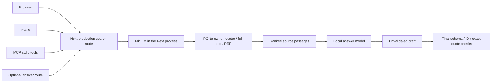

# Retrieval workbench

A local documentation search app that compares keyword, vector, and hybrid retrieval over pinned Zustand and TanStack Query sources, with optional locally generated answers. The browser, evaluation runner, and MCP tools use the same production Next.js search route, where the query embedding actually runs.

## Demo moment

Open [the local app](http://127.0.0.1:3300), search the prefilled pagination question, and select **Inspect passage** to see the exact stored text. Switch to keyword search, inspect the changed ranking, then open **Measured retrieval** and run `pnpm verify:mcp` in a terminal.

Public URL: not yet deployed. Source publication: pending. A local retrieval recording and protocol screenshots are available locally. Both a real MCP SDK client and MCP Inspector completed initialize → list tools → search_docs → get_chunk over stdio. A conversational MCP client demonstration is still pending.

## Core idea

Useful retrieval is a measurable prerequisite for grounded answers. We freeze source versions, chunk identities, model settings, and twenty questions before testing three rankers. A Next.js Node route embeds semantic queries with the shipped quantized `Xenova/all-MiniLM-L6-v2`; a single persisted PGlite process applies pgvector cosine distance and PostgreSQL full-text search. Reciprocal rank fusion combines the two ranked lists without pretending their raw scores share a scale. Search results expose exact source passages so a person or MCP client can inspect them. Optional Ollama answers stream a clearly unvalidated draft before the final schema, source-ID, and exact-quote checks; those mechanical checks do not establish factual entailment.

## Three decisions

1. **Ship MiniLM and run it in the Next route.** Reject a remote embedding API and an external embedding sidecar: local inference remains reproducible without a key and proves native-model packaging in the actual application. The pinned model revision is `751bff37182d3f1213fa05d7196b954e230abad9`, q8, 384 dimensions, mean pooling, L2 normalization. This is the permanent embedding model, including later's intended host.
2. **One PGlite owner, exact vector scans.** Reject multiple processes opening the same database directory, and reject an approximate vector index for 132 chunks. The separate loopback process makes persistence ownership explicit; the SQL is PostgreSQL/pgvector-compatible. Supabase connectivity is not yet verified.
3. **Freeze labels and show failures.** Reject changing labels to make hybrid search win. Hit@5 and MRR@5 use all eighteen answerable questions, including misses as zero; unsupported controls and complete two-source coverage are reported separately.

## Two observed failure modes

- **A related passage is not sufficient evidence.** All methods retrieved every required passage for zero of the two multi-source questions. Vector and hybrid also returned results for both unsupported questions. The UI explicitly says retrieval does not establish answerability; no fabricated answer or confidence percentage hides this behavior.
- **Application packaging can pass scripts but fail requests.** Query embeddings are tested through a production `next build` + `next start`, with process ID, `NODE_ENV=production`, pinned model metadata, and output dimensionality recorded by the real route. Missing model/cache or data-service access becomes an actionable API/UI error, not an empty successful result.

## Measured results

| Method | Hit@5 (18 questions) | MRR@5 (18 questions) | Both required sources (2 questions) | Unsupported controls returning passages |
| --- | --- | --- | --- | --- |
| Keyword | 8/18 = 44.4% | 0.4167 | 0/2 | 0/2 |
| Vector | 15/18 = 83.3% | 0.6157 | 0/2 | 2/2 |
| Hybrid | 15/18 = 83.3% | 0.6435 | 0/2 | 2/2 |

Measured 6 September 2026 in India (raw timestamp 2026-09-05T21:37:56.511Z), Windows 10.0.26200, Intel i5-11400H, 24 GB RAM, Node v24.19.0. Exactly 60 serial production API requests: one run for each of 20 questions and 3 modes, top-k 5. The corpus has 132 chunks from 10 documents. This is a small labeled development set, not a held-out generalization benchmark. Mean measured request durations were 12.2 ms keyword, 16.8 ms vector, and 18.6 ms hybrid after the model was warmed; these are observations from a shared laptop, not a latency guarantee.

[Raw final retrieval results](evidence/retrieval-eval.json), [frozen labels](evals/questions.json), [model/corpus hash](corpus/manifest.json), [production route proof](evidence/production-route-proof.json), [MCP round-trip evidence](evidence/mcp-client.json).

MRR uses the reciprocal rank of the first expected chunk, or zero for a miss. The complete-source score requires every listed expected ID. Unsupported controls have no expected IDs and are excluded from the answerable denominator; their returned results are reported rather than treated as correct rejections. Retrieval evaluations are final for this model and corpus. Local generation is measured separately below; rerun generation evaluations after the hosted chat model.

## What I would change with more time

Improve query decomposition and evaluate it on new, held-out multi-source questions. Paragraph-aware code-preserving chunk windows would make the retrieved context easier to read; current wordpiece-bounded windows sometimes split code snippets. Add a separately evaluated abstention policy before presenting generated answers as dependable evidence.

## Run locally

Prerequisites: Node 24, pnpm, the project dependencies. All commands below run from `Z:\STUDY\res\Portfolio\apps\rag`.

```powershell
pnpm install --frozen-lockfile
pnpm data
```

In another terminal, on a fresh checkout only:

```powershell
pnpm ingest
```

Then:

```powershell
pnpm build
pnpm start
```

The data owner listens on `127.0.0.1:3301`; Next listens on `127.0.0.1:3300`. `.data/postgres` persists across restarts; `.cache/transformers` stores the pinned model and `.cache/document-embeddings.json` caches ingest vectors. Do not run two data owners against the same directory. A first ingest downloads the small quantized model; subsequent runs reuse the local cache. Corpus snapshots and chunks are committed, so ingest does not require GitHub access.

```powershell
pnpm test
pnpm typecheck
pnpm lint
pnpm eval
pnpm verify:mcp
pnpm verify:browser
```

`pnpm eval` explicitly reruns and replaces the measured results file; do this only when a new measurement is intended. The shipping raw final results are already saved. The browser check uses Microsoft Edge and tests the production server.

## MCP clients

The server exports `search_docs(query, mode, k)` and `get_chunk(id)`. Protocol output goes to stdout; diagnostics belong on stderr. [Client configuration examples and tested commands](packages/mcp-server/README.md).



## Optional local answers

The existing `qwen2.5-coder:7b` in Ollama is used only for answer generation, never embeddings. **Draft an answer** calls the same retrieval route, then streams a complete answer-string draft before the enclosing JSON response has finished. The UI labels that text **Unvalidated draft**. Only after the complete object passes Zod validation, known-chunk checks, and exact quote-substring checks does the final result appear. An uncited result becomes an insufficient-evidence message; an invalid citation withholds the draft. This is not a semantic entailment verifier.

The production smoke question “How does Zustand update nested objects?” produced an answer with two exact citations from separate documents in 36.9 seconds. Browser evidence shows the draft before the final result, clickable citations, and zero automated axe violations at all three widths. That experiment ran one request at a time, with a 4096-token context, temperature zero and a 320-token output cap. The route now uses per-request cancellation and a two-minute model timeout; it does not claim to limit concurrency across serverless instances. `ANSWER_BASE_URL` and `ANSWER_MODEL` select an Ollama-compatible answer service. The model stays managed by the pre-existing Ollama service.

An observed compatibility correction: the local runner stopped when given the full Zod min/max-length JSON schema. A structural object/array/string decoder schema succeeded at the same context size. Full bounds remain enforced on the final application object. Both failed and successful probes are preserved in `evidence/ollama-schema-probe.json` and `evidence/ollama-structural-schema-probe.json`.

The one full local generation evaluation completed 60 application requests: the same 20 frozen questions in each retrieval mode, with no failed cases removed. [Final raw events and report](evidence/generation-eval.json) preserve the unchanged retrieval and label hashes. Checkpoints remain on disk. `pnpm eval:generation` deliberately starts a new pass; `pnpm exec tsx scripts/report-generation.ts` only derives diagnostics from saved events, with no inference.

| Retrieval mode | Expected citation (18 answerable) | Both required sources | Unsupported no-citation finals | Completed validated responses | Invalid citations withheld |
| --- | --- | --- | --- | --- | --- |
| Keyword | 7/18 = 38.9% | 0/2 | 2/2 | 19/20 | 1/8 observed model outputs |
| Vector | 12/18 = 66.7% | 0/2 | 2/2 | 17/20 | 3/20 observed model outputs |
| Hybrid | 12/18 = 66.7% | 0/2 | 2/2 | 17/20 | 3/20 observed model outputs |

Seven of 48 outputs observed at citation validation failed the source-ID or exact-quote check (14.6%) and were withheld. The denominator counts validated model finals plus explicit citation-validation errors; twelve keyword requests had no passages and skipped generation. Completed responses include those no-passage messages. There were no other failed requests in this pass. Every failure remains in the eighteen-answerable citation-coverage denominator. Coverage checks whether a final answer cited at least one expected chunk; it does not establish semantic entailment or overall answer accuracy. The two unsupported controls are too few to establish a general abstention policy.

Measured on 6 September 2026 in India with Ollama 0.17.1, `qwen2.5-coder:7b`, GGUF 7.6B Q4_K_M, digest `dae161e27b0e90dd1856c8bb3209201fd6736d8eb66298e75ed87571486f4364`. [Read-only runtime metadata](evidence/ollama-model-metadata.json) records the Intel i5-11400H, 24 GB RAM and RTX 3050 laptop GPU; the loaded-model snapshot reported a 4096-token context and about 3.28 GB in VRAM. Mean application request times were 8.0 s keyword, 29.6 s vector and 27.2 s hybrid on the shared laptop, including the fast no-passage requests. These are observations, not latency guarantees. Local generation results are provisional and must be rerun for the hosted chat model; the permanent MiniLM retrieval measurements remain final.

## Sources and design

The corpus includes original MIT notices in `corpus/licenses` and immutable source links in `corpus/sources.json`. [Transformers.js model](https://huggingface.co/Xenova/all-MiniLM-L6-v2), [PGlite extensions](https://pglite.dev/extensions/), [MCP TypeScript SDK v1](https://ts.sdk.modelcontextprotocol.io/).

UI direction: **Research reading desk**, an independent Literata / Source Sans 3 identity with neutral lilac paper, a muted plum accent and automatic system dark mode. `app/design-tokens.css` owns every theme and layout value; native browser theme colors derive from its light/dark surface tokens. Fonts and their licenses ship locally. [Design decisions](DESIGN.md) distinguish this redesign from the preserved historical shared-token release; the earlier screenshots remain evidence of that earlier build.

